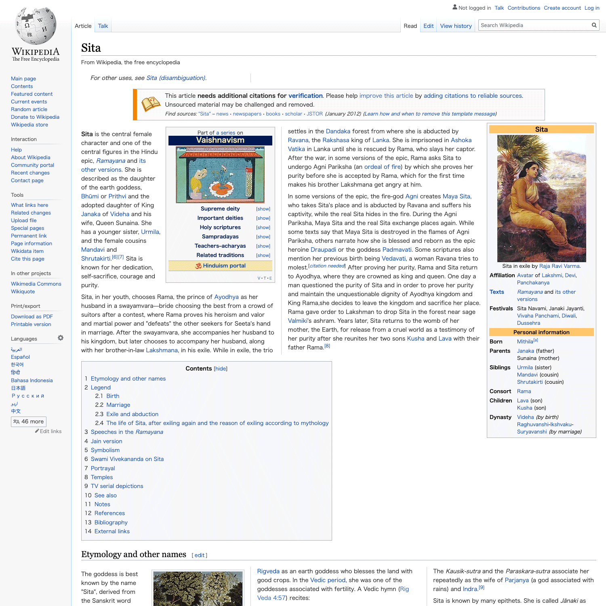

# Wikipedia Multi-Column Layout

A user script for [Tampermonkey](https://www.tampermonkey.net) or other user script managers to apply multi-column layout to Wikipedia.

## Screenshots

## Installation

### Chrome

After installing [Tampermonkey extension](https://chrome.google.com/webstore/detail/tampermonkey/dhdgffkkebhmkfjojejmpbldmpobfkfo), open [wikipedia-multicolumn.user.js](https://github.com/xoihazard/wikipedia-multicolumn/raw/master/wikipedia-multicolumn.user.js) in your browser and click on the "Install" button.

## License

MIT License